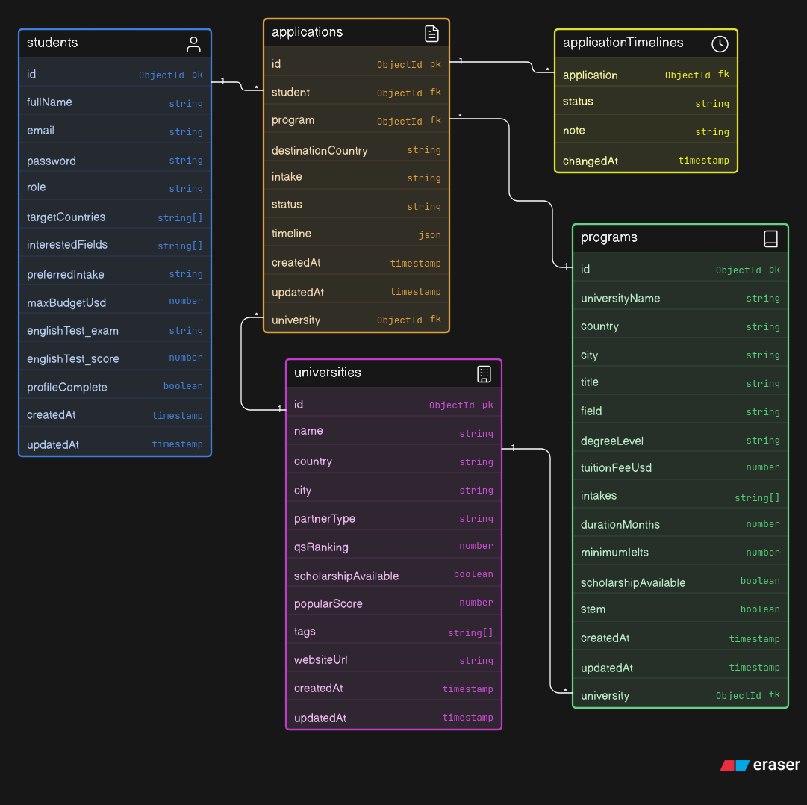

# waygood-backend

## Development
```
git clone https://github.com/manbeermaken/waygood-backend
cd waygood-backend
cp .env.example .env
npm install
npm run seed
npm run dev
```

## Building
```
npm run build
npm run start
```

## Docker
```
docker compose up -d
```

## Testing
Using [httpie](https://httpie.io/)
```
## register
http POST localhost:4000/api/auth/register

## login
http POST localhost:4000/api/auth/login --raw '{
  "email": "sara@example.com",
  "password": "Candidate123!"
}'

## me
http GET localhost:4000/api/auth/me 'Authorization:Bearer token' 
```
In current setup if user is deleted it can still access the site until token expires, it is better to implement short-lived access token and long-lived refresh token.

## Schemas


## To do
- [x] Convert to typescript
- [x] Use redis for cache
- [x] Use zod for strict type checking
- [x] Dockerize the app
- [ ] Convert to express 5
- [ ] Refresh token and endpoint
- [ ] Rate limiting
- [ ] Integrate an AI endpoint
